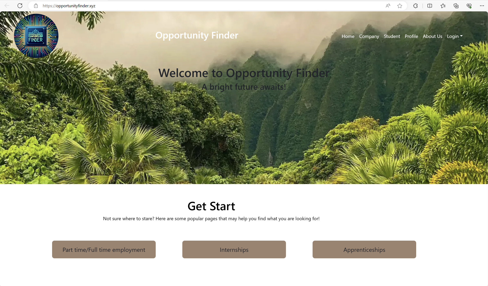
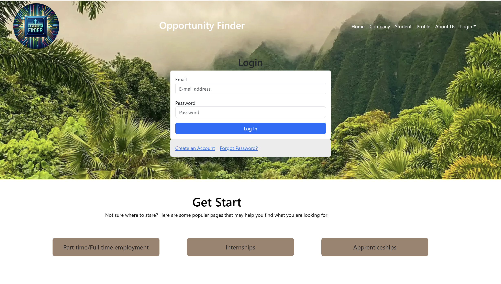
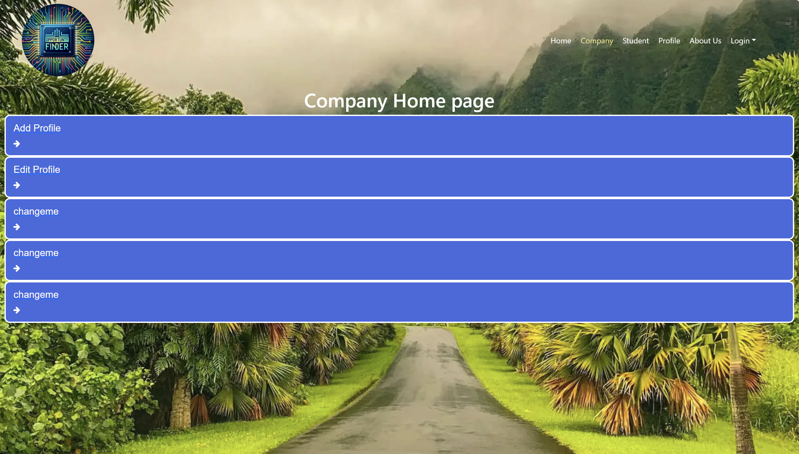
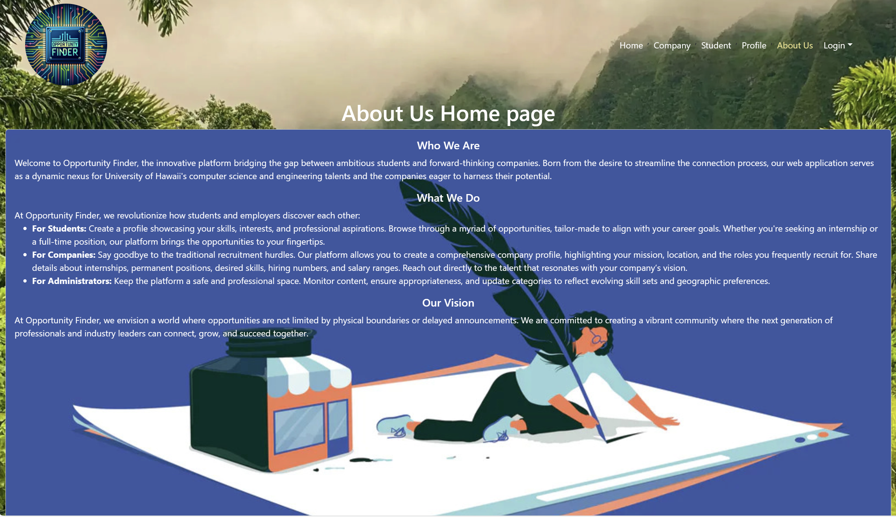

# Opportunity Finder


## Table of contents

* [Overview](#overview)
* [Implements](#implements)
* [User Guide](#user-guide)
* [Landing Page](#landing-page)
* [Log in/Sign up](#sign-in-and-sign-up)
* [Student Information](#student-information)
* [Student Home](#student-home)
* [Company Home](#company-home)
* [About Us](#about-us)
* [Community Feedback](#community-feedback)
* [Installation](#installation)
* [Team Contract](#team-contract)
* [Developers](#developers)


## Badge of CI


## Overview

The problem: Many UH computer science and engineering students want to learn about internship and job opportunities, but currently they must wait until a company decides to visit the campus or send out some sort of announcement. There is no efficient way for students to understand the “landscape” of internship and job opportunities that might be available in the future, so they can prepare for them now.

The solution: The Company Connector web application provides a new way for local and non-local companies who want to recruit students from UH to make their (potential) opportunities known to students. At the same time, students can create profiles on the site with their interests. The site can match students to employers and vice-versa.

## Implements
* [Meteor](https://www.meteor.com/) for Javascript-based implementation of client and server code.
* [React](https://reactjs.org/) for component-based UI implementation and routing.
* [React Bootstrap](https://react-bootstrap.github.io/) CSS Framework for UI design.
* [Uniforms](https://uniforms.tools/) for React and Semantic UI-based form design and display.


## User Guide

This section provides a walkthrough of the Company Connector interface and its capabilities.

### Landing Page

The landing page is presented to users when they visit the top-level URL to the site.





### Signing In and Signing Up

Click on the "Login" button in the upper right corner of the navbar, then select "Log In". You must have been previously registered with the system to use this option:



Alternatively, you can select "Sign up" to go to the following page and register as a new user:


### Student Information

As a student user after signing up, you are taken to a page, which presents a form where you can complete and/or update your personal profile that will help you find the best opportunities with employers that match your profile information:


### Student Home

Student user informations, which presents personal profile that will help you find the best opportunities with employers that match your profile information:


### Company Home

Company user informations, which presents companyl profile that will help student find the best opportunities with employers that match student profile information:



### About Us

Opportunity Finder information, Who we are and What we do:



### Installation

First, [install Meteor](https://www.meteor.com/install).

Second, visit the [Opportunity Finder application github page](https://github.com/opportunity-finder/opportunity-finder-meteor), and click the "Use this template" button to create your own repository initialized with a copy of this application. Alternatively, you can download the sources as a zip file or make a fork of the repo.  However you do it, download a copy of the repo to your local computer.

Third, cd into the Opportunity-Finder/app directory and install libraries with:

```
$ meteor npm install
```

Fourth, run the system with:

```
$ meteor npm run start
```

If all goes well, the application will appear at [http://localhost:3000](http://localhost:3000).

## Deployment
[Oppotunity Finder App](https://opportunityfinder.xyz/)

## Milestones
* [M1](https://github.com/orgs/opportunity-finder/projects/1)
* [M2](https://github.com/orgs/opportunity-finder/projects/3)
* [M3](https://github.com/orgs/opportunity-finder/projects/4/views/1)
* Please use the following account information to test the code. If you have any ideas or suggestions, feel free to share them.

We have three types of accounts: admin, student, and company.

- Admin Account:
  - Email: admin@foo.com
  - Password: changeme
  - Role: admin

- Student Account:
  - Email: john@foo.com
  - Password: changeme
  - Role: student

- Company Account:
  - Email: ethan@foo.com
  - Password: changeme
  - Role: employer

  
## Community Feedback

We are interested in your experience using Opportunity Finder!  If you would like, please take a couple of minutes to fill out the [Feedback Form](https://forms.gle/iuCLESE8DbvDxenF9). It contains only four short questions and will help us understand how to improve the system.


## Team Contract
[Contract](https://docs.google.com/document/d/1jCrtQtuHDYKzxooiK5d0gwH46wF7ocCgxg2zBi5oKk0/edit)

## Developers

1. Juvy Ann Lucero
2. Matthew Fallah
3. Ethan Mamuad 
4. Yafei, Wang

